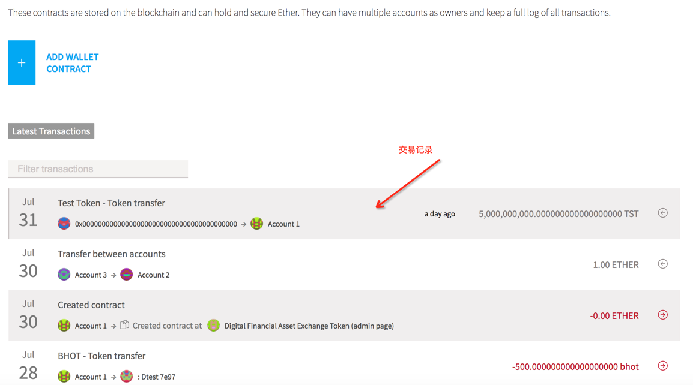
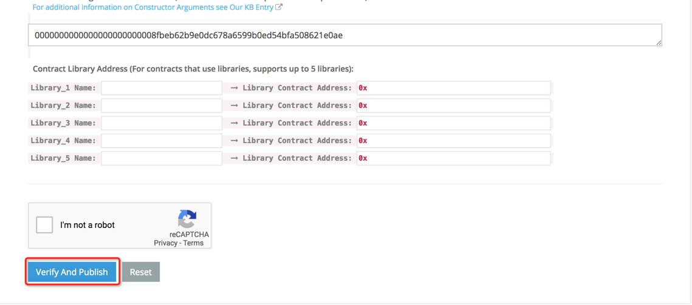

# dfxt
Dcoinfax token

## 发布合约

>通过以太坊官网提供的钱包工具部署(也可以通过web3j编写java代码部署)
>>下载

从https://github.com/ethereum/mist/releases/tag/v0.11.1 选择适合当前系统版本安装包下载，安装

>>发布合约

切换到主网络。在菜单栏中选择"开发-网络-主网络"

创建账号。菜单栏中选择"账户-新建账户"

部署

    点击钱包窗口右上角"CONTRACTS"；

    在新的界面中点击"DEPLOY NEW CONTRACT"；

    选择创建账户(账户中要有足够的以太币)；

    将合约代码复制到合约编辑窗口，钱包对合约代码进行检测，若有编译错误会有提示，检测通过，右侧显示代码中可以部署的合约，选择需要部署的合约，若合约构造函数需要输入参数，在列出的输入框中填写；

    钱包工具会自动计算所需费用（可以进行调整，费用设置越高，操作被确认会越快）；

    点击下方的"DEPLOY"按钮，在弹出的窗口中填写发布账户的密码，点击"SEND TRANSACTION"，部署。

查看部署状态。

    在WALLETS界面的下方展示最近发出的所有交易。点击上面发布合约的交易记录，然后点击交易的hash地址的链接去etherscan.io查看交易的状态。

## 发布合约源码

在etherscan.io查找到已发布的合约

在页面的下方点击"code"tab页，然后点击"Verify And Publish"链接

在新页面中，填写合约名称/solidity版本/复制合约源码

点击下方的"Verify And Publish"校验并发布

## 更新imtoken代币信息

需要提交资料至 imToken github 。

具体教程请参考: https://github.com/consenlabs/token-profile/blob/master/README.md

